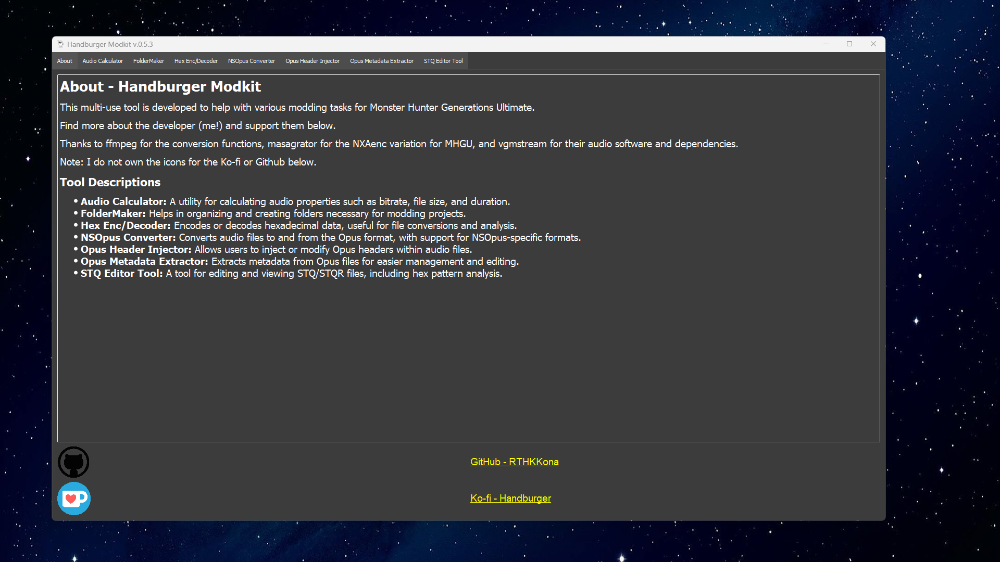
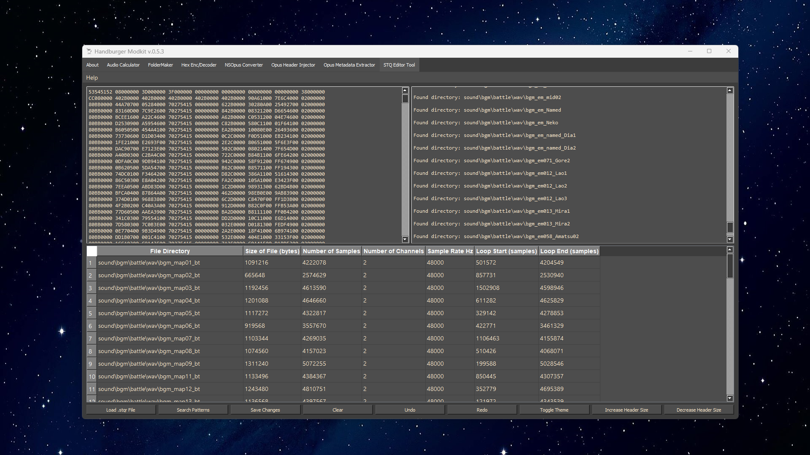
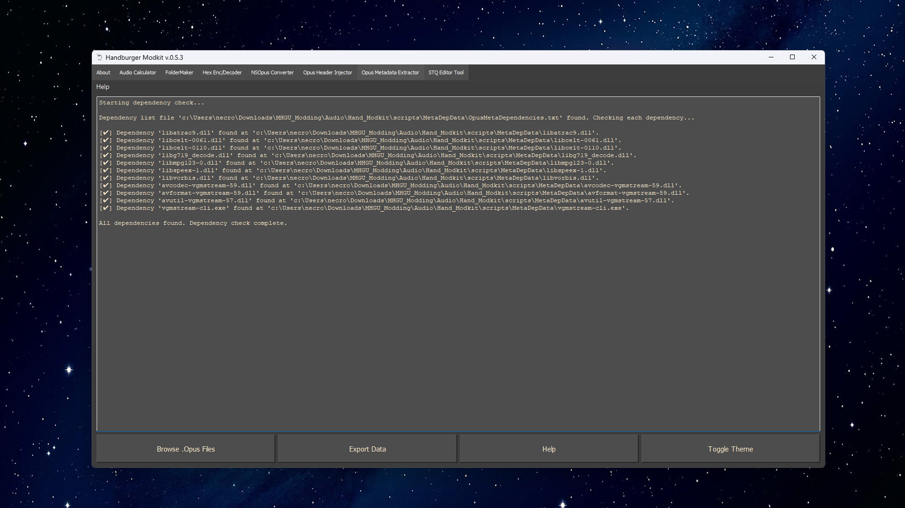
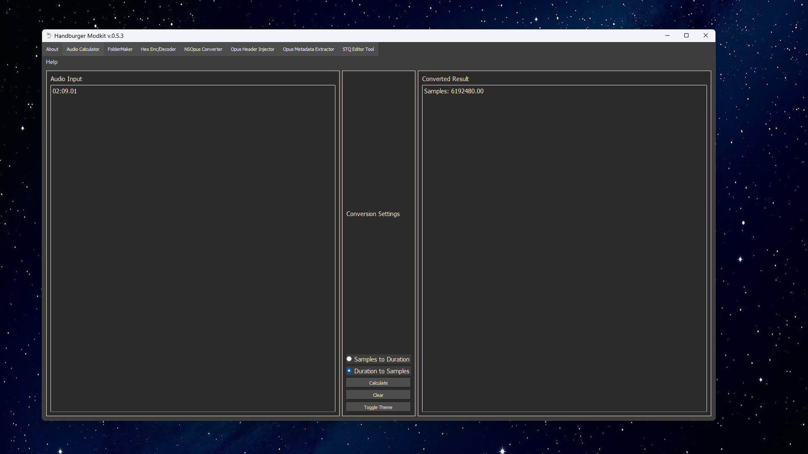
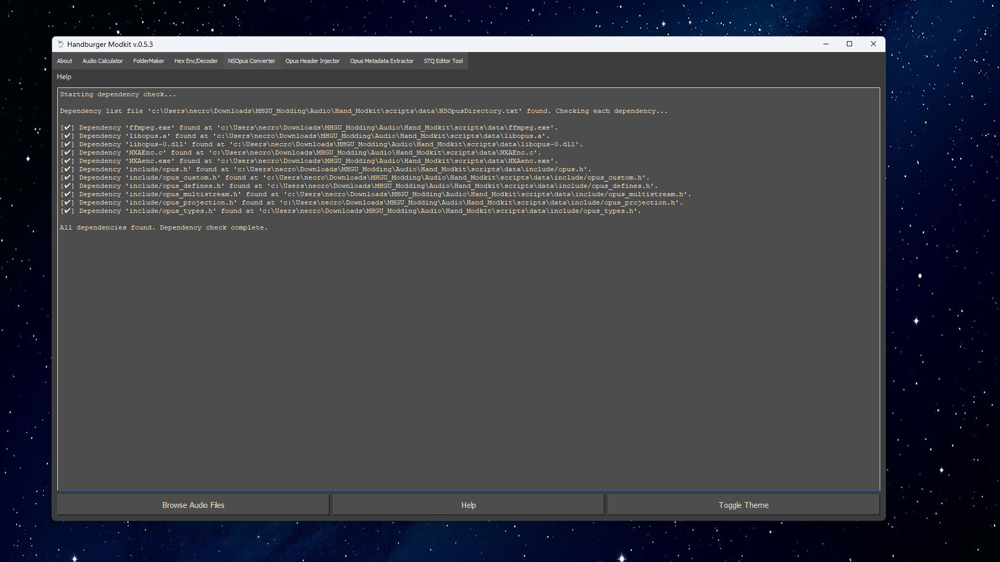
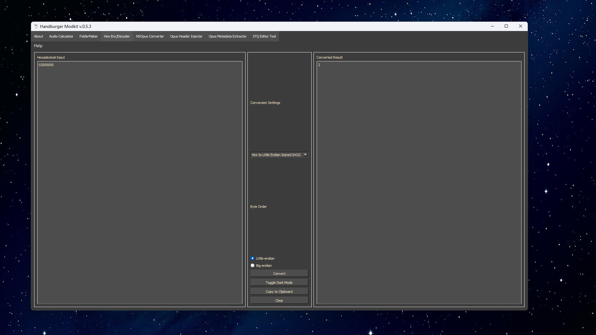
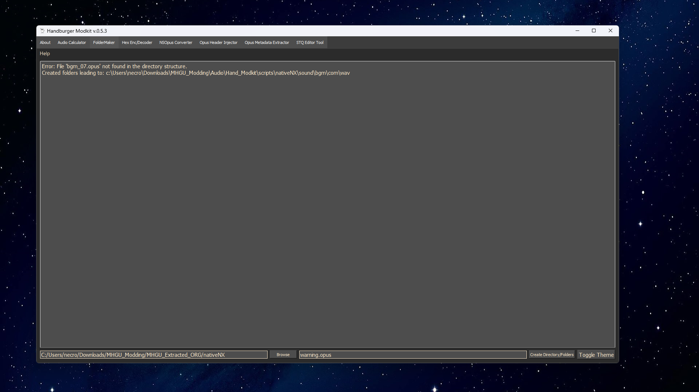

# Hand_Modkit

Hand_Modkit, also known as the Handburger Modkit or H.Modkit, is a versatile multi-use tool designed for modding *Monster Hunter Generations Ultimate* (MHGU). With a suite of specialized utilities, this toolkit gives modders tools to easily edit, analyze, and manage various game files. Whether you're injecting audio headers, calculating audio properties, or organizing mod folders, Hand_Modkit simplifies the complex tasks involved in MHGU modding.

## Features

- **Audio Calculator**: Calculate audio properties such as bitrate, file size, and duration.
- **FolderMaker**: Create folders and directories for your projects.
- **Hex Encoder/Decoder**: Encode or decode hexadecimal data, useful for file conversions and analysis.
- **MCA Converter**: Converts WAV files to MCA format using Dasding's wav2dsp.exe and mcatool.py.
- **MCA Forge**: Merge two MCA files to create a custom MCA header for advanced audio modding.
- **NS Opus Converter**: Convert audio files to and from the Opus format, with support for Nintendo Switch `.Opus` format for MHGU.
- **Opus Header Injector**: Modify Opus headers and inject edited ones into headerless Opus audio files.
- **Opus Metadata Extractor**: Extract metadata from Opus files for easier management and editing.
- **STQ Editor Tool**: Edit and view STQ/STQR files, including hex pattern analysis and specific hexadecimal editing.
- **STQ Merge Tool**: Merge modified STQR files for multiple mod usage. Includes conflict management, saving functionality, and hexadecimal editing.

## Screenshots

## Getting Started

### Prerequisites

- **Python 3.12.x**: Ensure you have Python installed on your machine. You can download it [here](https://www.python.org/downloads/).
- **PyQt5**: Install PyQt5, the library used for the GUI. You can install it via pip:
  \`\`\`bash
  pip install PyQt5
  \`\`\`

### Installation

1. Clone the repository:
   \`\`\`bash
   git clone https://github.com/RTHKKona/Hand_Modkit.git
   \`\`\`
2. Navigate to the project directory:
   \`\`\`bash
   cd Hand_Modkit
   \`\`\`
3. Open up \`Hb_Modkit.py\` or any standalone Python script in \`/scripts/\`.

## Future Features

I'm working to improve Hand_Modkit and expand its capabilities. Here's a glimpse of what's coming in future updates:

- **MCA Header Injector/Editor**: A tool for injecting and editing headers in MCA files, allowing for more detailed control over audio modifications.
- **Kuriimu2 Compatibility**: Integration with Kuriimu2, including support for \`.dll\` files, opening \`.arc\` files, and editing \`.tex\` files. This will enhance Hand_Modkit's versatility and allow seamless editing of game assets.
- **Compile into Full Exe**: The goal is to compile Hand_Modkit into a standalone executable, making it easier to distribute and use without requiring a Python environment.
- **Better GUI for Easier Use**: We're working on refining the graphical user interface to make it more intuitive and user-friendly, ensuring that even new users can navigate and use the tool effectively.

Stay tuned for these updates!

## Contributions

Contributions are welcome! Feel free to fork the repository, make changes, and submit a pull request if you have suggestions for improvements.

## Contributors

#### Lead Developer

#### Translators

## Acknowledgements

- **masagrator** for his MHGU NXAenc from his NX-Scripts. Without this, the Opus conversions would not be possible.
- **ffmpeg** for audio functionality dependencies.
- **vgmstream** for reading and working with game audio data.
- **Dasding** for his MH4/MHX modding conversion tools.

## Bug Reports & Feature Requests

Please use the [issue tracker](https://github.com/RTHKKona/Hand_Modkit/issues) to report bugs or request new features.

## Support

If you find this tool useful and want to support its development, consider buying me a coffee!

#### Dynamic Contributor List

Made with [contrib.rocks](https://contrib.rocks).

## License

This project is licensed under the MIT License - see the [LICENSE](LICENSE) file for details.
